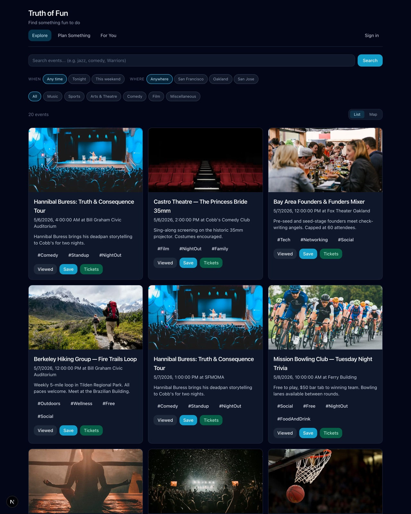
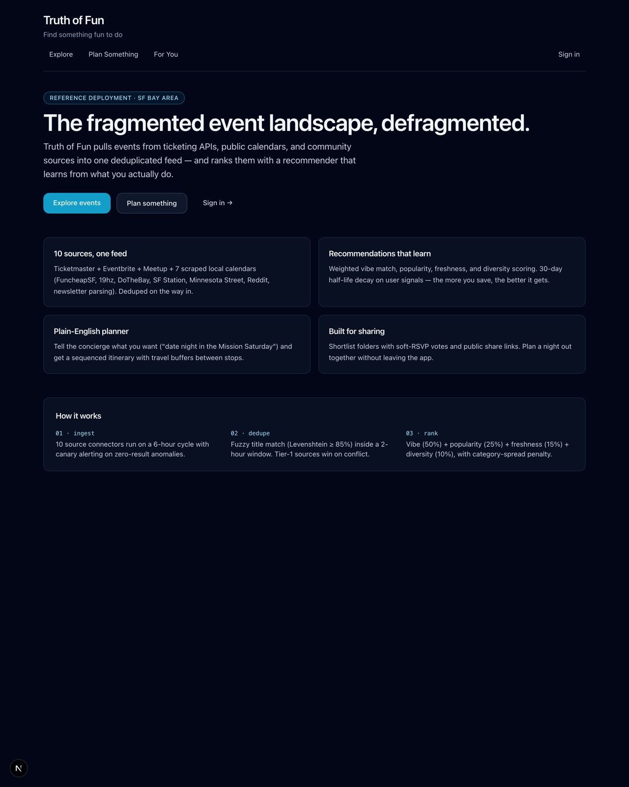
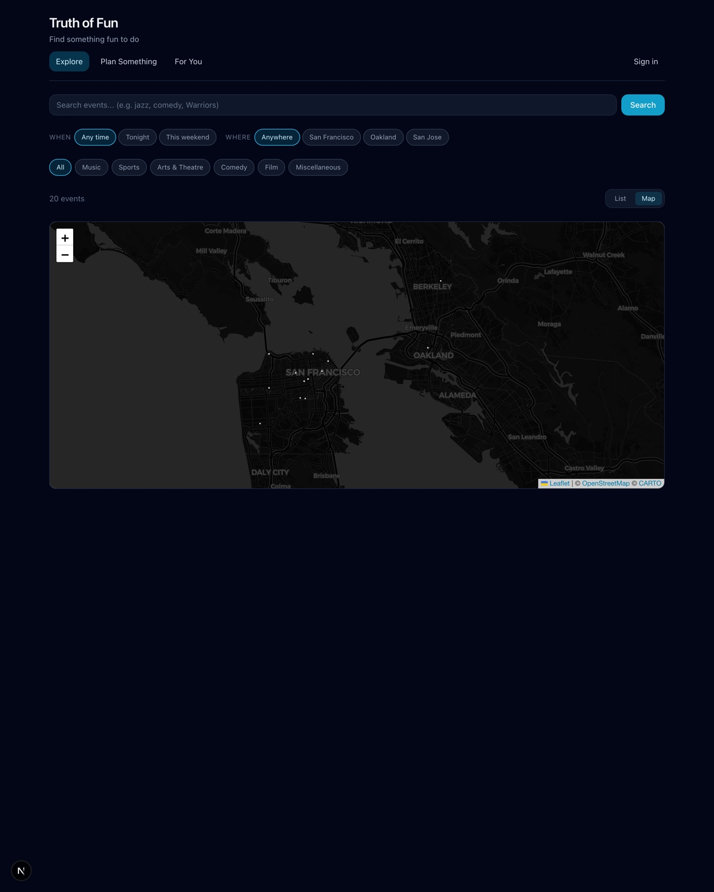
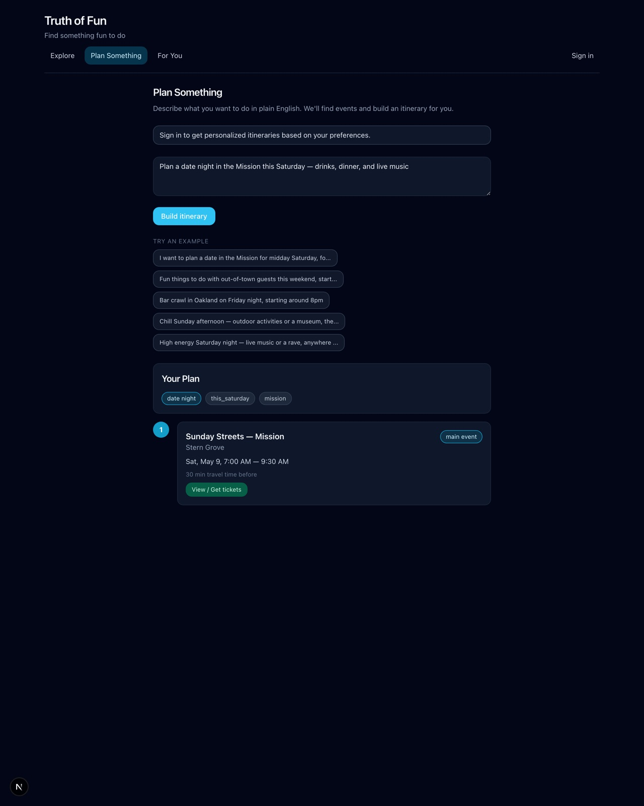
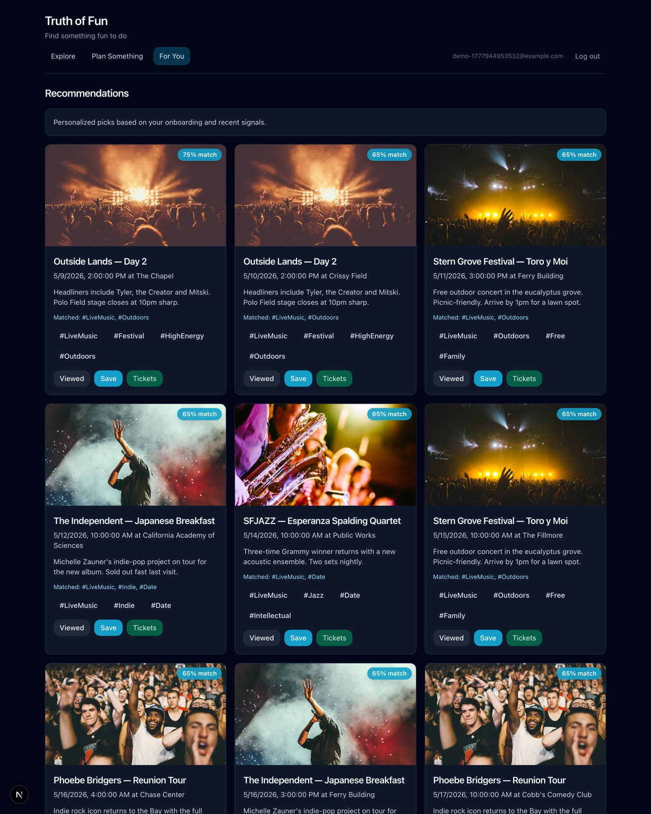
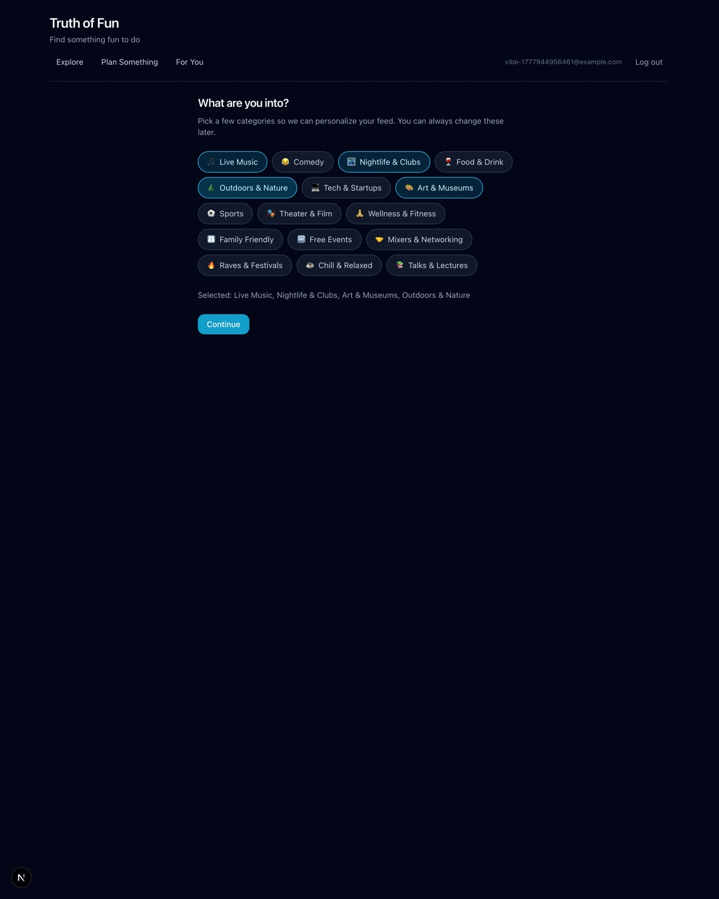
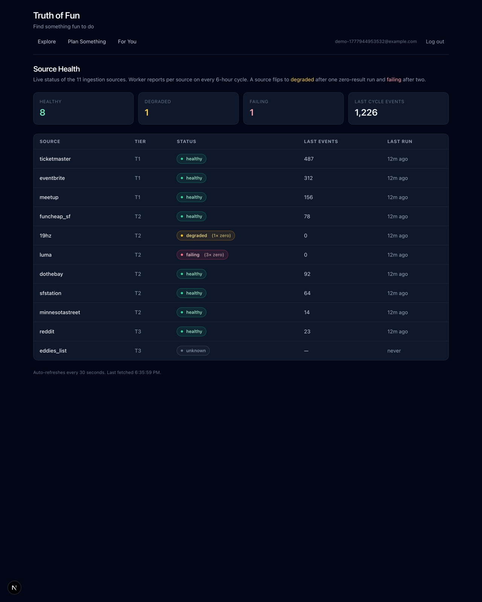

# Truth of Fun

> The fragmented event landscape, defragmented.

Truth of Fun pulls events from ticketing APIs, public calendars, scrapers, and community sources into a single deduplicated feed — and ranks them with a recommender that learns from what users actually do.

The reference deployment is configured for the SF Bay Area (Ticketmaster DMA 382, FuncheapSF, 19hz, DoTheBay, SF Station, Minnesota Street Project, Reddit, Eddie's List newsletter). Sources are modular — drop in agents for other regions by editing `app/ingestion/sources/`.

[](./LICENSE)




## Why this exists

Event discovery in any large city is a fragmented mess. A single Friday night in SF might involve checking Ticketmaster (concerts), Eventbrite (workshops), Meetup (recurring groups), FuncheapSF (free things), 19hz (electronic music), DoTheBay (local listings), a Substack newsletter, and r/AskSF — each with different schemas, freshness, and UX. There's no single "what's on tonight."

The hard parts aren't the scrapers. They're:

1. **Entity resolution across sources.** The same concert appears on Ticketmaster, the venue's own site, and three local calendars — with different titles, slightly different start times, and different price metadata. You need fuzzy match plus tier-based source preference plus richer-value merge.
2. **Cold-start ranking.** New users have no signal. The system needs to ladder smoothly from "show me the popular stuff" → "show me what's like the things I clicked" → "show me variety so I don't see 8 jazz nights in a row."
3. **Unstructured input.** Half the interesting stuff is buried in newsletter HTML, Reddit threads, and free-form event descriptions. Need an LLM in the ingestion path to normalize it into structured tags.
4. **Source health.** Scrapers break silently when sites change. Need canary alerting, not just "Sentry".

## What's in here

| Layer | Highlights |
| --- | --- |
| **Ingestion** | 10 source connectors (REST, GraphQL, Playwright-stealth, IMAP). Per-source rate limiting. 6-hour scheduled cycle. Canary alerting (zero-result detection vs historic average) with healthy/degraded/failing state machine. AAIM-backed key rotation with Redis quota tracking. |
| **Pipeline** | Schema.org/Event canonical model with PostGIS geometry. Levenshtein title fuzzy match (≥ 85%) inside a 2-hour window. Tier-based source preference. Richer-value merge (longest description, earliest start, latest end, lowest price). Status-severity escalation (`scheduled` → `postponed` → `cancelled` → `past`). |
| **Intelligence** | Anthropic Claude generates vibe tags from unstructured event descriptions. LLM-driven concierge intent parser (with deterministic keyword fallback) extracts intent + geography + timeframe from natural-language requests like *"date night in the Mission Saturday"*. |
| **Ranking** | Multi-signal scoring: vibe match (50%) + popularity (25%) + freshness (15%) + diversity (10%). 30-day half-life decay on user behavioral signals. Consecutive-category penalty for spread. |
| **Concierge** | Anchor + pre/post sequencing within a 0.5-mile radius of the main event. Inserts 30-minute travel buffers between stops. |
| **Social** | Shared shortlist folders, soft-RSVP votes, public share tokens, friends-interested counts on event cards. |
| **Frontend** | Next.js 15 / React 19 / Tailwind. Typed API client (`packages/api-client`) consumable by any client (web today, mobile later). |
| **Infra** | FastAPI (async) + SQLModel + Alembic + Redis. Docker Compose for local. Production guard refuses to boot if `JWT_SECRET_KEY` is unset outside development. |

## Architecture

```mermaid
flowchart LR
    subgraph Sources["10 sources"]
        TM[Ticketmaster<br/>REST]
        EB[Eventbrite<br/>scraper]
        MU[Meetup<br/>GraphQL]
        FC[FuncheapSF<br/>Playwright]
        H19[19hz<br/>httpx]
        DTB[DoTheBay<br/>httpx]
        SFS[SF Station<br/>httpx]
        MSP[Minnesota St<br/>httpx]
        RDT[Reddit<br/>JSON API]
        ED[Eddie's List<br/>IMAP]
    end

    Sources -->|raw payloads| Worker[Async ingestion worker<br/>6-hour cycle<br/>canary alerting]

    Worker --> Pipeline[Data pipeline<br/>fuzzy dedupe + tier merge]
    Pipeline -->|LLM tagging| Claude[(Anthropic Claude<br/>Haiku)]
    Claude --> Pipeline

    Pipeline --> DB[(PostgreSQL 16<br/>+ PostGIS)]

    DB --> API[FastAPI]
    API --> Recommender[Recommender<br/>vibe + popularity +<br/>freshness + diversity]
    API --> Concierge[Concierge<br/>LLM intent parse +<br/>itinerary sequencing]

    Recommender --> Web[Next.js Web]
    Concierge --> Web
    API --> Web

    UserSignals[User signals<br/>save/click/like<br/>30-day half-life] --> Recommender
    Web -->|interest events| UserSignals
```



## Screenshots

|  |  |
| --- | --- |
| **Home** — landing page <br/>  | **Explore** — deduped, filtered, image-rich event grid <br/>  |
| **Map view** — venues plotted from PostGIS geometry <br/>  | **Plan something** — natural-language → itinerary <br/>  |
| **For You** — multi-signal personalized recommendations <br/>  | **Onboarding** — vibe-picker for cold-start signal <br/>  |
| **Source health** — live status of all 11 ingestion sources <br/>  | |

## Quick start

Requires Python 3.11, Node 20+, and Docker.

```bash
# One-time install
make install

# Bring up Postgres+PostGIS, run migrations, seed ~40 demo events
make demo

# Then in two terminals
make api     # FastAPI on :8000  (Swagger UI at /docs)
make web     # Next.js on :3000
```

Open http://localhost:3000.

The demo seed populates a varied event set (concerts, comedy, sports, free outdoor, nightlife, art) so the explore/recommend/concierge flows have data immediately. Run `make seed-reset` to wipe and re-seed.

To pull real data, set `TICKETMASTER_API_KEY` (and optionally `ANTHROPIC_API_KEY` for vibe tagging) in `.env`, then `make worker` to run the ingestion pipeline once.

## Repository layout

```
app/                  FastAPI backend (~7,800 LoC Python)
  api/                Routers: auth, discovery, social, health, internal_secrets
  services/           recommender, concierge (LLM), data_pipeline (dedupe), vibe_tagger
  ingestion/          Source connectors, base classes, canary metrics
  models/             SQLModel ORM
  core/               config (with prod guard), database, security
alembic/              Database migrations
apps/web/             Next.js frontend (~2,200 LoC TS)
packages/api-client/  Shared TypeScript HTTP client + types
scripts/              seed_demo.py, capture_screenshots.mjs
docs/                 Public architecture and contract docs
tests/                pytest suite (24 files)
```

## Configuration

All runtime config is read from environment variables — see [`.env.example`](./.env.example). The most important ones:

| Variable | Required? | Notes |
| --- | --- | --- |
| `DATABASE_URL` | yes | Postgres + PostGIS DSN |
| `JWT_SECRET_KEY` | yes for non-dev | Generate with `python -c "import secrets; print(secrets.token_urlsafe(48))"`. Startup refuses to boot in non-`development` `APP_ENV` if unset. |
| `TICKETMASTER_API_KEY` | optional | Disables Ticketmaster ingestion if blank |
| `ANTHROPIC_API_KEY` | optional | Disables LLM vibe tagging and falls the concierge back to keyword intent parsing if blank |
| `REDIS_URL` | optional | Required only if `AAIM_ENABLED=true` |
| `PROXY_URL` / `PROXY_ROTATION` | optional | For scrapers behind aggressive bot protection |

## Documentation

- [Architecture](./docs/architecture.md) — pipeline, dedupe heuristic, scoring weights, intelligence plane
- [API contract (v1)](./docs/api-contract-v1.md) — request/response shapes for all 19 endpoints
- [Frontend architecture](./docs/frontend-architecture.md) — shared-client strategy
- [Input agents](./docs/input-agents/README.md) — per-source ingestion specs
- [Integration testability matrix](./docs/INTEGRATIONS.md) — which sources need credentials

## Testing

```bash
.venv/bin/pytest                   # backend (24 test files)
npm run web:typecheck              # web type check
npm run web:lint                   # web lint
npm run web:test                   # web E2E (Playwright, requires backend running)
```

## Responsible-use notes

This project includes web scrapers for public event calendars. When deploying for real:

- Honor `robots.txt` and Terms of Service for each source.
- Set conservative rate limits and a descriptive `User-Agent`.
- Prefer official APIs when available.
- Don't republish copyrighted descriptions or images without permission — link back to the source.

## License

[MIT](./LICENSE) © 2026 Matthew Roy
